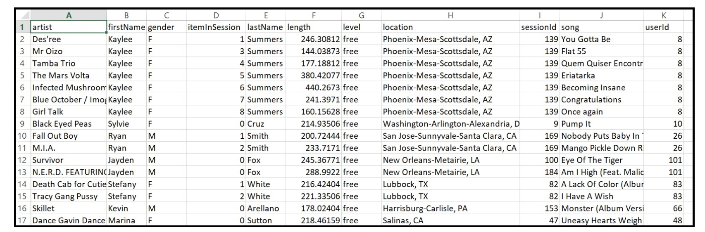

# Description 

This project involves creating an ETL pipeline and creating tables for three queries using Apache Cassandra. In Apache Cassandra, the data model is modeled depending on the query needs for fast data retrieval. This use case shows how a music startup like spotify can model data using NOSQL for their needs. The jupyter notebook file can be viewed for a detailed walk through of the project starting from the need to creation of data model and finally ending with populating all tables using Apache Cassandra.

# Purpose

A music streaming start up wants to create a nosql database for specific querying requirements. While a previoulsy built relational schema satisifes some of their query needs, having nosql tables for cases which need low latency results and faster data retrieval is desirable. Since we have decided to use Apache Cassandra as our choice of database, it is important to collect requirements from our end users. It is very important to remember that data is modeled after the queries in Apache Cassandra. 

# So what is needed ?

Below is an image showing three queries that we need to use for data modeling. 

# Data: 

The data used for this project is a subset of the reasearch dataset found here [Dataset](http://millionsongdataset.com/)

Heres an image to show you a few columns - 

# Schema

**For the first query:

Column 1 = sessionId
Column 2 = itemInSession
Column 3 = artist
Column 4 = song
Column 5 = length
Primary key = (sessionId, itemInSession)

**For the second query:

Column 1 = userId
Column 2 = sessionId
Column 3 = artist
Column 4 = song
Column 5 = itemInSession
Column 6 = firstName
Column 7 = lastName
Primary key = (userId, sessionId) with clustering column itemInSession

**For the third query:

Column 1 = song
Column 2 = firstName
Column 3 = lastName
Primary key = (song, userid)

# Code

Please open the .ipynb notebook for code. Code for ETL, table creation, data insertion. 
